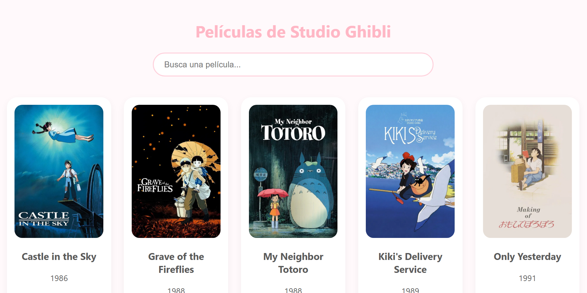

✨ Ghibli Magic Explorer ✨
¡Hola! Soy Angela y este es mi proyecto para el taller de APIs. Decidí hacerlo sobre Studio Ghibli porque sus películas tienen una estética hermosa y quería que mi página transmitiera esa misma tranquilidad.

Aquí abajo te cuento un poco de lo que hice y cómo funciona.

📝 De qué trata mi app
Básicamente, creé una página que se conecta con un servidor externo para traer toda la info de las películas de Ghibli. Puedes ver los pósters, los años en que salieron y, si te da curiosidad alguna, solo le das clic para leer de qué trata.

Nombre del proyecto: Ghibli Magic Explorer.

Hecho por: Angela Arrivillaga (Camper con mucho café encima ☕).

API que elegí: Studio Ghibli API.

🚀 Lo que puede hacer (Funcionalidades)
Para este taller me aseguré de cumplir con todo lo que pidió el profe:

Listado completo: Vas a ver más de 10 películas en pantalla apenas cargue la página.

Ver detalles: Si haces clic en una tarjeta, te sale un aviso con la descripción y quién la dirigió.

Buscador mágico: Puse una barrita arriba para que escribas el nombre y la lista se filtre solita mientras escribes.

Avisos: Si el internet falla, te sale un mensaje de error, y mientras cargan las fotos, te avisa que está "buscando la magia".

🛠️ ¿Qué usé para armarlo?
No usé nada de librerías raras ni frameworks, solo lo que hemos visto en clase:

HTML5: Para que todo esté en su lugar.

CSS3: Para que se vea lindo, con colores pastel y bordes redonditos (estilo Soft Girl).

JavaScript: Mi parte favorita y la más difícil. Usé fetch con async/await para que la página sea interactiva.

📸 Así se ve mi trabajo

📖 Cómo probarlo en tu compu
Si quieres ver cómo quedó, es súper fácil:

Descarga mi carpeta del proyecto.

Busca el archivo que dice index.html.

Dale doble clic y ¡listo! Se abrirá en tu navegador.

O busca el pages en git hub.